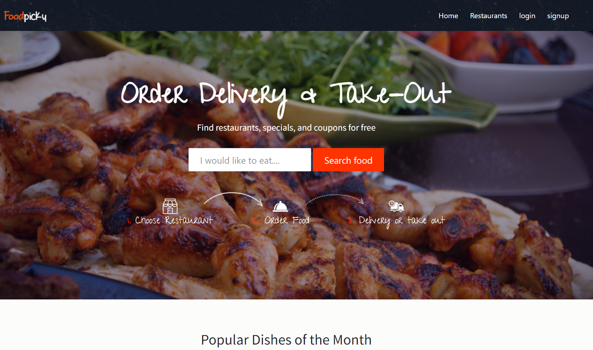

<<<<<<< HEAD
# README

## About this project?

This project is about ordering online food from your local restaurants. Anybody can create an account and order online. you are free to to use this project for college or school purposes. Please note that this project is not made for business or commercial purposes.

## Installation or Demo

Just create new database in phpmyadmin and import SQL file which is located in `SQL/` directory. If you don't know, how to setup this project on your localhost then watch this youtube video: [https://youtu.be/aBiIgUhe0Jk](https://youtu.be/aBiIgUhe0Jk)

## Admin Dashboard

To access admin portal type this in your URL BAR **\`root**/admin/ \`  where **root** is your root directory

 **Admin credentials:** Username: **admin** Password: **1234**

## Technologies Used

1. PHP
2. SQL
3. BOOTSTRAP 4
4. AJAX
5. JQUERY

## System Requirements

Software : XAMPP / Wamp / Mamp/ Lamp \(anyone\).

## Want custom PHP project?

If you looking for specific project for your school or college then follow me on intagram and message me there. [https://www.instagram.com/code\_lone/](https://www.instagram.com/code_lone/)

=======
# Fork-N-Spoon-Restro
Fork N Spoon Restro is your ultimate online food ordering platform, delivering your favorite restaurant dishes right to your doorstep. We connect you with local eateries, making it easy to enjoy delicious meals at home. Experience convenient, home dining with Fork N Spoon Restro!
>>>>>>> c3b1525b7e70c56bc12d1b723e2194bd521605b5
